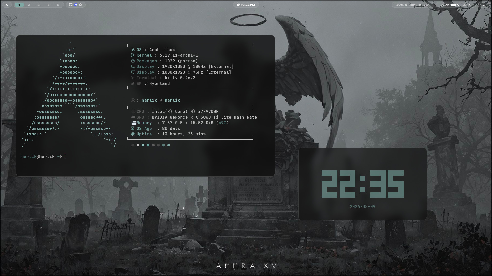

# dotself
**My ideal dots for Arch Hyprland.**



## Tools

- **WM:** [Hyprland](https://hypr.land/)
- **Lock:** [hyprlock](https://github.com/hyprwm/hyprlock)
- **Wallpaper:** [hyprpaper](https://github.com/hyprwm/hyprpaper)
- **Screenshots:** [hyprshot](https://github.com/Gustash/Hyprshot)
- **Color picker:** [hyprpicker](https://github.com/hyprwm/hyprpicker)
- **Terminal:** [kitty](https://sw.kovidgoyal.net/kitty/)
- **Shell:** [fish](https://fishshell.com/)
- **Bar:** [Waybar](https://github.com/Alexays/Waybar)
- **Launcher:** [rofi](https://github.com/davatorium/rofi)
- **Notifications:** [mako](https://github.com/emersion/mako)
- **File manager:** [Thunar](https://docs.xfce.org/xfce/thunar/start)
- **Editor:** [VSCodium](https://vscodium.com/)
- **System info:** [fastfetch](https://github.com/fastfetch-cli/fastfetch)
- **Clock:** [tty-clock](https://github.com/xorg62/tty-clock)
- **Theming:** [pywal16](https://github.com/eylles/pywal16) + [wpgtk](https://github.com/deviantfero/wpgtk)
- **Dotfiles:** [GNU Stow](https://www.gnu.org/software/stow/)

## Install

```
sudo pacman -S stow kitty fish mako rofi waybar fastfetch tty-clock \
    hyprland hyprlock hyprpaper hyprpicker thunar \
    brightnessctl playerctl networkmanager network-manager-applet
yay -S wpgtk python-pywal16 hyprshot vscodium-bin
```
